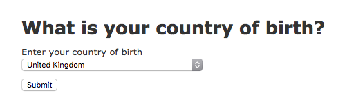

(DRAFT/INCOMPLETE) How to integrate a Registers-backed Location Picker into a Rails project
===

This guide will show you how to:

- Use the Location Picker Register data file.
- Populate a location picker [autocomplete field](https://github.com/alphagov/accessible-typeahead).

Other things you might be interested in:

- [guide-api-client.md](https://github.com/openregister/rails-picker-example/blob/guide-api-client/guide-api-client.md): A guide about accomplishing this task using `openregister-ruby`;

## What you need

This guide assumes you have a service that is written in Ruby on Rails and asks users to select a country or territory (a **location**). Something like this:



> :warning: TODO: Style the example app to look GDSy.
>
> This involves throwing a bucket of GOVUK paint on the example application and makes the docs looks slightly prettier and more finished. It's very low priority.

At the end, your location picker will be populated automatically with data from Registers, and will look and function more like this:


> :warning: TODO: Replace with a gif of the actual location picker running in the same example app.
>
> The current gif is from Ed and it's from a different app, and looks out of place. This task can only be truly done after most of the other TODOs in this document are done but will make the docs look more finished and relevant. Low priority.

## The example application

To illustrate this process, this guide will use this application as a base: [openregister/rails-picker-example](https://github.com/openregister/rails-picker-example).

Key things to know about the example app:

- It's barebones and based on the starter `rails new`, and a `rails generate`d `Answer` model/view/controller.
- The application asks users to provide their country of birth. This information is saved as an `Answer`.
- Users are provided with a select box that submits the relevant location code as part of an HTML form `POST` request.
- The location codes are persisted as [ISO 3166-1 alpha-2 codes](https://en.wikipedia.org/wiki/ISO_3166-1_alpha-2#Officially_assigned_code_elements). So if a user picks "United Kingdom," they submit `location_code: "GB"`.
- The list of recognised locations is defined in `app/helpers/answers_helper.rb` and consists of a hardcoded array of location names and codes.

## The process

We'll be updating the example app by doing the following:

- We'll replace the hardcoded array of locations with Registers data.
- We'll enhance the frontend into an [accessible autocomplete](https://github.com/alphagov/accessible-typeahead) widget.

### Pulling in Registers data

The app currently defines the list of locations in `app/helpers/answers_helper.rb`. It's a simple hardcoded array of names and location codes, which get mapped into a slightly different array (to work in an `options_for_select` call):

```ruby
def locations_for_select
  [
    { "name": "Afghanistan", "location_code": "AF" },
    { "name": "Albania", "location_code": "AL" },
    # …snip…
  ].map { |location|
    [location[:name], location[:location_code]]
  }
end
```

To get Location Picker data from Registers, we can pull in two files:

- [location-picker-canonical-list.json](public/location-picker-canonical-list.json): A list of every canonical country and territory;
- [location-picker-graph.json](public/location-picker-graph.json): A directed acyclic graph of mappings between locations and abbreviations, synonyms, endonyms, typos.

Copy those two files to the `public/` folder in your application.

The `location-picker-canonical-list.json` file contains an array of arrays containing the location names and ISO codes:

```ruby
> JSON.parse(File.read('public/location-picker-canonical-list.json'))
[["Abu Dhabi", "AE-AZ"], ["Afghanistan", "AF"], …]
```

> :warning: TODO: Change to use curies instead.
>
> This is a file I generated for use on the Rails server to produce the initial un-typeaheaded select. I made it with country codes but Andy convinced me to use node names (which are curies 90% of the time).
>
> We need to update the file to contain `[NAME, NODE_NAME]` pairs, so `["Abu Dhabi", "AE-AZ"]` becomes `["Abu Dhabi", "territory:AE-AZ"]`.


We can use this array directly as the data source for our select:

```ruby
def locations_for_select
  JSON.parse(File.read('public/location-picker-canonical-list.json'))
end
```

The app is now successfully pulling in Registers data to display the list of countries. For users that don't have JavaScript, this is the experience they will continue receiving, but now it's time to make it better.

> :warning: TODO: Discuss migrating from existing result formats (names, ISO codes) to curies.
>
> In addition to the above task, we should briefly discuss in the documentation about how an existing application that is built to use "country codes" could implement support for node names. I think we could demonstrate how to create a mapping from node names to "country codes" here as that's a likely real use case.

> :warning: TODO: Discuss keeping the data up to date. Job included with the gem to check for new versions? Ask people to do it periodically manually?
>
> The current documentation suggests that you should copy and paste two JSON files into your application, but offers no path to keep them up to date.

> :warning: TODO: Discuss exclusions here? Provide helper methods?
>
> The current documentation does not discuss in any way what users should do when they need to exclude or add certain locations, to interface with their legacy systems or to accommodate their business requirement.

### Progressively enhancing to a typeahead

The example application uses location picker data in a simple HTML `<select>` element:

```html
# app/views/answers/_form.html.erb

<%= f.label :location_code, "Enter your country of birth", for: "location_picker" %>
<%= f.select :location_code, options_for_select(locations_for_select, @answer.location_code), {}, id: "location_picker" %>
```

We need to include this CSS and JS in our `layouts/application.html.erb`:

```html
<!-- In your <head> -->
<link rel="stylesheet" href="https://unpkg.com/accessible-typeahead@0.4.0/examples/styled.css" />

<!-- At the end of your <body> -->
<script type="text/javascript" src="https://unpkg.com/registers-picker-engine@0.0.1"></script>
<script type="text/javascript" src="https://unpkg.com/accessible-typeahead@0.4.0"></script>
```

> :warning: TODO: Provide a gem / better ways to obtain / vendor these.
>
> The docs ask you to hotlink to the stylesheet and scripts for the typeahead. We should provide gems or packages so that users can use them more safely.

In our main `application.js`, we can do this:

```js
var pathToGraph = '/location-picker-graph.json'
var selectElement = document.getElementById('location_picker')
if (selectElement) {
  AccessibleTypeahead.enhanceSelectElement({
    selectElement: selectElement,
    source: locationPickerSuggestions(pathToGraph)
  })
}
```

That should be it. This will render the same `<select>` menu as before on the server, but hides it and progressively enhances to a typeahead when JavaScript kicks in. When the user selects something in the typeahead, the hidden `<select>` menu is still updated, so everything works as before.
