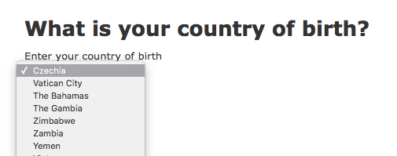

How to integrate a Registers-backed Location Picker into a Rails project
===

This guide will show you how to:

- Pull in data from the [Country](https://country.register.gov.uk/) and [Territory](https://territory.beta.openregister.org/) Register.
- Persist and update the data automatically.
- Populate a location picker [autocomplete field](https://github.com/alphagov/accessible-typeahead).

Other things you might be interested in:

- [Registers school demo](https://github.com/openregister/school-demo): A Rails app to demo access and display of school register data.
- [openregister-ruby](https://github.com/robmckinnon/openregister-ruby): A Ruby API to query registers.
- [e-petitions PR 435](https://github.com/alphagov/e-petitions/pull/435): This PR illustrates how the e-petitions project integrated with the Country register, and is similar to the work being carried out in this guide.

## What you need

This guide assumes you have a service that is written in Ruby on Rails and asks users to select a country or territory (a **location**). Something like this:


TODO: Style the example app to look GDSy.

At the end, your location picker will be populated automatically with data from Registers, and will look and function more like this:


TODO: Replace with a gif of the actual location picker running in the same example app.

## The example application

To illustrate this process, this guide will use this application as a base: [openregister/rails-picker-example](https://github.com/openregister/rails-picker-example).

TODO: Fix link, create the actual repository.

Key things to know about the example app:

- It's barebones and based on the starter `rails new`, and a `rails generate`d `Answer` model/view/controller.
- The application is running a Postgres database.
- The application asks users to provide their country of birth. This information is saved as an `Answer`.
- Users are provided with a select box that submits the relevant location code as part of an HTML form `POST` request.
- The location codes are persisted as [ISO 3166-1 alpha-2 codes](https://en.wikipedia.org/wiki/ISO_3166-1_alpha-2#Officially_assigned_code_elements). So if a user picks "United Kingdom," they submit `location_code: "GB"`.
- The list of recognised locations is defined in `app/helpers/answers_helper.rb` and consists of a hardcoded array of location names and codes.

## The process

We'll be updating the example app by doing the following:

- We'll replace the hardcoded array of locations with Registers data.
- We'll persist the data.
- We'll add an automated job to keep the data up to date.
- We'll enhance the frontend into an [accessible autocomplete](https://github.com/alphagov/accessible-typeahead) widget.

### Pulling in Registers data

The app currently defines the list of locations in `app/helpers/answers_helper.rb`. It's a simple hardcoded array of names and location codes, which get mapped into a slightly different array (to work in an `options_for_select` call):

```ruby
def locations_for_select
  [
    { "name": "Afghanistan", "location_code": "AF" },
    { "name": "Albania", "location_code": "AL" },
    # …snip…
  ].map { |location|
    [location[:name], location[:location_code]]
  }
end
```

The Country Register provides an [HTTP endpoint](https://country.register.gov.uk/records.json) that will display all the latest entries. The [openregister-ruby](https://github.com/robmckinnon/openregister-ruby) gem wraps these endpoints with a Ruby-friendly API that we can use.

Install the gem:

```ruby
# In your Gemfile:
gem 'openregister-ruby', git: 'https://github.com/robmckinnon/openregister-ruby.git'
```

```bash
bundle install
```

Here's an example of how to use it:

```ruby
> require 'openregister'
> register = OpenRegister.register 'country'
> records = register._records
> country = records.first
=> #<OpenRegister::Country:0x00000005c0a2d8 @entry_number="205", @entry_timestamp="2016-11-11T16:25:07Z", @item_hash="sha-256:c69c04fff98c59aabd739d43018e87a25fd51a00c37d100721cc68fa9003a720", @country="CZ", @name="Czechia", @official_name="The Czech Republic", @citizen_names="Czech", @start_date="1993-01-01", @end_date=nil>
> records.map { |r| [r.name, r.country]}
=> [["Czechia", "CZ"], ["Vatican City", "VA"], …]
```

We can update the previous method to this:

```ruby
require 'openregister'

def locations_for_select
  register = OpenRegister.register 'country'
  records = register._records
  records.map { |r| [r.name, r.country]}
end
```



TODO: Update image with GDSy styling.

The app is now successfully pulling in Registers data to display the list of countries.

Before we move on to other issues, as this is a location picker, we'll want to pull in the territories, and order them alphabetically:

```ruby
def locations_for_select
  country_register = OpenRegister.register 'country'
  territory_register = OpenRegister.register 'territory'
  countries = country_register._records.map { |r| [r.name, r.country]}
  territories = territory_register._records.map { |r| [r.name, r.territory]}
  locations = countries + territories
  locations.sort { |x, y| x[0] <=> y[0] }
end
```

TODO: Set the pagination limit correctly in the above code so it actually fetches all the countries.

At this point, assuming the new list of countries and territories matches the one that was previously in place, the select will be successfully populated from the Registers on render.

TODO: Talk about exclusions here?

There are a few issues.

The main one is that the helper is currently performing an HTTP call to the live Registers in order to fetch the list of locations. Even with a cache that would alleviate the latency issues somewhat, should Registers go down for an extended period of time, the cache would eventually flush, and you'd lose access to the list of locations.

This approach also does not scale to other use cases that use Registers with more than a few hundred items. We won't be tackling those use cases in this guide.

Because of the issues above, it makes sense to persist this data in some way. Because our example application has a database, we'll use it for this.

### Persisting the data

> Note that the register also [provides ways to download it as CSV, TSV, YAML, plain JSON](https://country.register.gov.uk/records). It might make sense for your project to not use a database for this step, in particular if you don't already have one.
